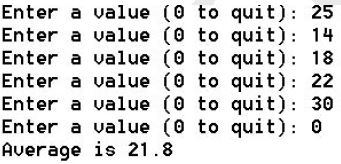
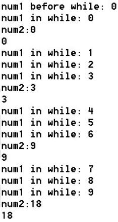

# Loop Structures


## While Loops
The `while statement` is a `loop structure`, which executes a set of statements
over and over again based on a `condition`. Loop structures are used to
perform tasks such as 

- summing a set of numbers as they are entered by
the user

- repeatedly prompting the user for a value until valid data is

```
while (<condition>) {
  <statements>
}
```

Just like in an `if statement`, the condition of a `while` loop is a Boolean expression. 

- When the condition is *true* the statements are executed. 

- When the condition is *false*,  program flow continues to the next statement after the closing curly brace of the while.

This `while` statement executes 5 times. 

```
var num = 0;
while (num < 5) {
  num += 1;
}  
// program picks up here after loop breaks
```

Note that for num values of 0, 1, 2, 3, and 4 the boolean expression num < 5 is true. Once num becomes 5, the expression 5 < 5 is false and the loop breaks.

In the above example, num is known as a `control variable`. It is a variable in charge of controlling the loop.

> Write a 

> Example. Write a while loop that prints the phrase "Hello, world!" 25 times.

> Example. Write a while loop that prints the numbers 0 to 99.

## Do-While Loops
The `do-while` statement is an alternative form of the while statement. In the do-while statement the condition is not evaluated until after the first
execution of the loop. Therefore, the do-while executes *at least once*.

The do-while takes the following form:

```
do {
  <statements>
} while (<condition>);
```

The following do-while example prompts the user until a valid number is entered:

```
do {
  playerNum = +prompt("Enter a number less than 4:");
} while (playerNum >= 4);
```

> Example. Use a do-while loop to print the numbers -10 to +10.

> Example. Prompt the user to enter the string "stop". If they don't type "stop" keep looping through the prompt.

## Infinite Loops
The condition of a loop is used to determine when the loop should stop
executing. A while continues until its condition is false. What happens,
though, if the condition never becomes false? The result is an `infinite
loop`—one which continues forever. For example, the following generates
an infinite loop. Can you see why?

```
var num = -1;
while (num < 0) {
  num = -1;
}
```

The code causes the application to simply stop responding or just “hang.”
When this happens, close the output window to end the application. Note
that some compilers may require a different procedure to end an infinite
loop. 
> Repl.it you will have to close the tab and open it again. Pro-tip:  ctrl-shift-t will reopen a recently closed tab.

Syntax errors are a common cause of infinite loops. For example, a
semicolon after the condition causes the statement to check the condition,
do nothing, check the condition, do nothing, and on and on:

```
while (num < 0); { //an infinite loop here--added semicolon
  num += 1;
}
```

A logic error can also lead to an infinite loop condition. For example, in the code below num is initialized to 1 and never decremented to a number less than 0 in the loop, making the condition of the loop structure always true:

```
var num = 1;
do {
  num += 1;
} while (num >= 0); 
```

> Example. Create a Prompter application that prompts the user for 2 numbers. The 1st number is a min value and the second is a max value. Prompter then prompts the user for a number between the min and max numbers entered. The user should be continually prompted until a number within the range is entered. Be sure to include the min and max numbers in the prompt.

Another option for controlling your loops is to intentionally cause an infinite loop, but then use a break statement within the loop to break out.

> Example. Prompt the user to enter a number between 1 and 10. A loop should be used to keep asking for input if they don't enter a proper number.

The continue statement can be used to skip certain iterations of the loop.

> Example. Write a loop that logs the numbers from 25 down to 1, but skips the numbers 18 and 7.


## Counters & Accumulators

Many programs require you to count and sum up some values. For example,
an application that calculates the average of a set of numbers must sum
the numbers and then divide the total by the count. The AverageValue
application performs counting and summing. A run of the application might look liks this:



To count the number of values entered by the user is the same thing as counting how many times the loop runs. One run through a loop is called an `iteration`. The above output shows the loop went through 6 `iterations` before stopping.

To count loop iterations, you can use a variable to track the number of times the loop has run:

```
let numValues = 0;
while (<condition>){
  numValues += 1;
}
```

Each time the statement executes, one is added to the current value of the variable. This type of variable is called a `counter` because it goes up by a constant value, in this case 1.

Counters are useful for keeping track of the number
of times a user enters a value, makes a guess, or types a password. A
counter should be initialized when it is declared and then incremented
by a fixed amount.

A similar assignment statement is used to sum values as they are entered by the user:

```
sumOfValues += newValue;
```

This statement would be inside the loop, and a new value is added to a running total of values.

> Example. Write an Average Value application that prompts the user for values until they type 0. When they type 0, calculate and display the average of the numbers they typed in.

> Example. Create an Evens application that displays the even numbers between 1 and 20, inclusive (include the 20 in the display).

> Example. Create a NumbersSum application that prompts the user for a number and then displays the numbers 1
through the number entered, each on a separate line. Below the numbers, the sum is displayed.

> Example. Create a PercentPassing application that prompts the user for a set of scores and then counts and displays the number of scores above 50%. The user should have the option to enter as many scores as needed. (Hint: Use an if statement and another counter.)


## The for statement
The `for statement` is a loop structure that executes a set of statements a fixed number of times. The for statement takes the form:

```
for (<initialization>; <condition>; <increment>) {
  <statements>
}
```

- initialization is performed ONCE when the for loop begins.
- The condition is evaluated BEFORE each loop iteration. When true, the loop statements are run. When false, the program flow moves to the closing for loop curly bracket. 
- The increment changes the control variable so that eventually the condition will be false and the loop will end.

In this example, the numbers 1 through 10 are displayed:

```
for (let i = 0; i <= 10; i++){
  console.log(i);
}
```

Note: The counter `i` is declared in the for loop. With a declaration in this location, the `scope` of the counter is from the initialization to the closing curly brace of the for statement. The application will not recognize the variable outside of that statement. Declaring variables so that their scope is limited to where they are needed is good programming style because it produces cleaner code and helps eliminate the possibility of errors. 

```
for (let i = 0; i <= 10; i++){
  console.log(i);
}
console.log(i)  // produces error saying i is not defined
```

The statement above uses the ++ operator in the increment part of the for statement (i++). The `++` operator is called the increment operator because it increases the value of a variable by 1. 

Any combination of components can be left out of a for statement. This can be useful when a counter is declared and initialized outside the statement,
as in the following code:

```
var num = +prompt('Enter the starting number');

for (; num <= 10; num++){
  console.log(num);
}
```

A for statement may also count down from a start value to an end value using the `decrement operator`, `--`:

```
for (let countDown = 10; countDown <= 0; countDown--) {
  console.log(countDown);
}
```

> Example. Write a BlastOff application that uses a for loop to count down from 10 to 1 then says BLASTOFF!

> Example. Create a Factorial application that prompts the user for a number and then displays its factorial. The factorial of a number is the product of all the positive integers from 1 to the number. For example, 5! = 5x4x3x2x1 = 120

> Example. Create an Odd Sum application that prompts the user for a number and then sums the odd numbers from 1 to the number entered.

# Debugging
A handy debugging technique to use involves adding console.log statements to an application. Adding console.log statements just after a variable is assigned a new value or before and after a condition is evaluated can help detect the source of a logic error. For example, the code segment below includes additional statements for debugging:

```
var num1 = 0;
var num2 = 0;
console.log("num1 before while: " + num1); //debug
while (num1 < 10) {
  console.log("num1 in while: " + num1); //debug
  if (num1 % 3 == 0) {
    num2 += num1;
    console.log("num2:" + num2); //debug
    console.log(num2 + " ");
  }
  num1 += 1;
}
```

When run, the code above displays the following output, which can be compared to the values expected.




`Commenting Out Code` : statements can be an effective way to locate a bug through process of elimination. Typically the // characters are easiest to type at the beginning of a statement to “comment it out.”

> You Try. Using paper and pencil or notepad, create a variable trace for the following code, tracing the values of num1, num2, i, and
any output:

```
var num1 = 0;
var num2 = 0;
for (let i = 0; i <= 4; i++) {
  num1 = i * i;
  num2 += num1;
  console.log(num1 + " ");
} 
console.log(num2);
```


